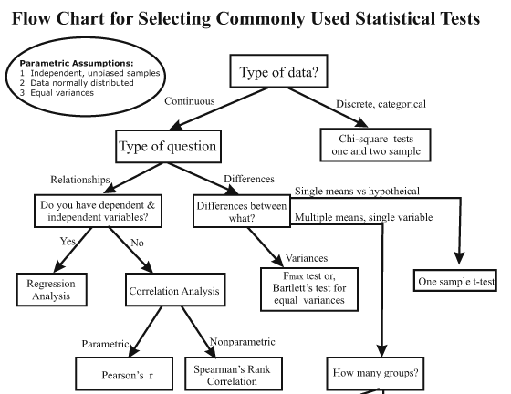
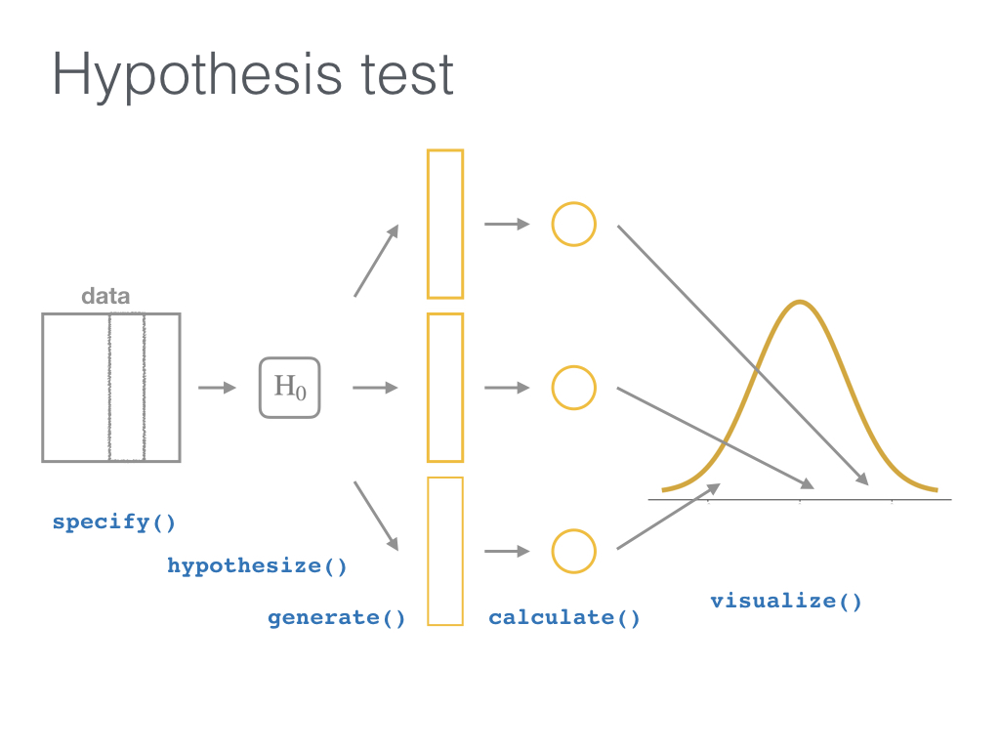
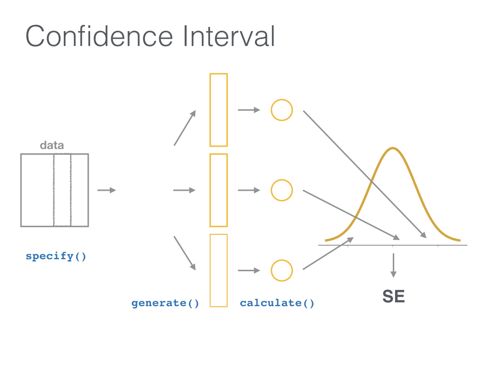

```{r setup, include=FALSE}
options(htmltools.dir.version = FALSE)
```

```{r xaringan-themer, include=FALSE}
library(xaringanthemer)
mono_light(
  base_color = "#123649",
  code_font_family = "Fira Code",
  code_font_url    = "https://cdn.rawgit.com/tonsky/FiraCode/1.204/distr/fira_code.css",
  # title_slide_background_image ="logo_hug.png",
  title_slide_background_position = "90% 90%",
  title_slide_background_size = "250px",
  code_font_size = "70%"
)
library(knitr)
```

```{r include=FALSE}
library(tidyverse)
filter <- dplyr::filter
knitr::opts_chunk$set(warning=FALSE, message=FALSE, fig.width=10.5, fig.height=4, 
  comment=NA, rows.print=16)
theme_set(theme_gray(base_size = 24))
```

---

## Goals of this new package

- "The objective of this package is to perform statistical inference using an expressive statistical grammar that coheres with the tidyverse design framework." (source: https://infer.netlify.com/)

- Implement **common statistical inference** (i.e. confidence intervals for difference in means and proportions, t test, Chi-Square test) in the **tidyverse** framework

- Implement common statistical inference in a way that makes the **underlying procedure more "transparent" **

- Allow the use of **simulations** to compute classical tests and confidence intervals for beginners

---
class: inverse, center, middle

# Implementation in the tidyverse framework

---

class: middle

## Motivating example

- Data from a cohort study (Adler & al, 2017,  Comorbidities and Subgroups of Patients Surviving Severe Acute Hypercapnic Respiratory Failure in the Intensive Care Unit, AJRCCM)

- Seventy-eight ICU patients admitted for an episode of acute hypercapnic respiratory failure

- Follow-up over 1 year

- Outcome of interest: readmission or death

---

## Motivating example

```{r echo=FALSE, message=FALSE, warning=FALSE}
library(readxl)
BDD_ajrccm <- read_excel("BDD_ajrccm.xls")
BDD_ajrccm <- BDD_ajrccm %>% 
  na.omit() %>% 
  mutate(COPD = case_when(
    COPD %in% 1 ~ "yes",
    COPD %in% 0 ~ "no"
  )) %>% 
  mutate(Event = case_when(
    Event %in% 1 ~ "yes",
    Event %in% 0 ~ "no"
  )) 
BDD_ajrccm

```

---


## Motivating example


- Suppose that we are interested in the association between COPD and readmission or death (Event)

- Are COPD patients at higher risk of readmission or death?

- Which hypothesis test should we conduct ?

- And what if we are interested in the association between FEV1 and readmission or death (Event) ?

---

## Association between COPD and readmission or death

- Descriptive analysis

```{r echo=TRUE, message=FALSE, warning=FALSE}
BDD_ajrccm %>% count(COPD, Event)

BDD_ajrccm %>% 
  janitor::tabyl(COPD, Event) %>%
  janitor::adorn_totals(where = c("row", "col")) %>%
  janitor::adorn_percentages() %>%
  janitor::adorn_pct_formatting(digits=2) %>% 
  janitor::adorn_ns()
```


---

## Association between COPD and readmission or death

- Statistical test : Chi-Square test 

- If we try to use the `chisq.test` in a "tidyverse" way:

```{r eval=TRUE, error = TRUE}
chisq.test(BDD_ajrccm, COPD, Event)
```


- OK :

```{r}
chisq.test(BDD_ajrccm$COPD, BDD_ajrccm$Event)
class(chisq.test(BDD_ajrccm$COPD, BDD_ajrccm$Event))
```

---

## Association between COPD and readmission or death

- Statistical test : test of equality of 2 proportions

- Using `prop.test` function

```{r}
prop.test(x = c(7, 20), n = c(13, 32))
```

---

## Association between FEV1 and readmission or death

- Descriptive analysis

```{r echo=TRUE, message=FALSE, warning=FALSE}
BDD_ajrccm %>% 
  group_by(Event) %>% 
  summarise(mean_fev1 = mean(FEV1), sd_fev1 = sd(FEV1))

```

---
## Association between FEV1 and readmission or death

```{r echo=TRUE, message=FALSE, warning=FALSE}
BDD_ajrccm %>% 
  ggplot(aes(x = Event, y = FEV1)) + geom_boxplot()
```

---

## Association between FEV1 and readmission or death


- Statistical test : test of equality of 2 means, i.e. t-test

- Using `t.test` function

```{r message=FALSE, warning=FALSE, paged.print=TRUE}
t.test(data = BDD_ajrccm, FEV1 ~ Event)
```

```{r echo = TRUE, results = 'hide'}

t.test(BDD_ajrccm$FEV1[BDD_ajrccm$Event== "no"], BDD_ajrccm$FEV1[BDD_ajrccm$Event== "yes"])

```
---

class: middle

## Tidyverse framework

- Dataframe in, dataframe out

- Function should be "pipable"

- 1st argument is the name of the tibble

- Could use formula 

---
class: inverse, center, middle

# Perform statistical inference using an expressive statistical grammar and simulations

---

## Logic of hypothesis testing

- A statistical test is a way to decide between 2 hypotheses:
  
     - The null hypothesis $\mathrm{H_0}$: there is no association between COPD and readmission or death
    
    - The alternative hypothesis $\mathrm{H_1}$: an association exists between COPD and readmission or death
    
- Logic behind all hypothesis testing:

      - Take a random sample (or samples) from a population (or multiple populations)

      - If the sample data are consistent with $\mathrm{H_0}$ do not reject $\mathrm{H_0}$
      
      - If the sample data are inconsistent with $\mathrm{H_0}$, reject $\mathrm{H_0}$ and conclude that there is evidence that $\mathrm{H_1}$ is true (based on the particular sample collected).

---

## Logic of hypothesis testing

- How do we decide that the data are consistent or not with $\mathrm{H_0}$?

    - We compute a test statistic $\delta$ based on the data $\rightarrow$ $\delta^{\star}$
    
    - Based on the distribution of $\delta$ under $\mathrm{H_0}$, we compute the probablity of observing a value of $\delta$ as extreme of more extreme than $\delta^{\star}$ $\rightarrow$ p-value
    
    - How do we know the distribution of $\delta$ under $\mathrm{H_0}$: via statistical theory or via simulations
    
- Authors of the `infer` package want to emphasize the common underlying logic behind all statistical tests

---

## Confusing view of hypothesis testing

[](https://i.pinimg.com/originals/e5/ea/32/e5ea322d61bd36a5062080b1b5fe6daa.gif)
---

class: middle


[](http://allendowney.blogspot.com/2016/06/there-is-still-only-one-test.html)

This diagramm was the inspiration for the infer pipeline

.footer[Source: http://allendowney.blogspot.com/2016/06/there-is-still-only-one-test.html]


---

## Hypothesis testing via simulations

- How do we simulate data assuming that $\mathrm{H_0}$ is true?

- By using permutations

- Back to the association between COPD and readmission/death: if we assume that there is no association, we can shuffle the "yes" or "no" values for the variable coding readmission/death to create a new sample

- We then compute a new value ot the test statistic $\delta$ on this new simulated sample

- We can repeat these 2 steps 5000 times and compute on how many samples the computed $\delta$ were more extreme than the one observed on the data $\delta^{\star}$

---

## One sample obtained via permutation

- We compare the original sample with the sample obtained via permutation

```{r message=FALSE, warning=FALSE, include=FALSE}
library(infer)
set.seed(125554)

perm1 <- BDD_ajrccm %>% 
  specify(Event ~ COPD, success = "yes") %>% 
  hypothesize(null = "independence") %>% 
  generate(reps = 1, type = "permute") %>% 
  ungroup() %>% 
  dplyr::select(-replicate)
```


```{r echo=TRUE, message=FALSE, warning=FALSE}
BDD_ajrccm %>% 
  janitor::tabyl(Event, COPD) %>% 
  janitor::adorn_totals(where = c("row", "col"))
perm1 %>% 
  janitor::tabyl(Event, COPD) %>% 
  janitor::adorn_totals(where = c("row", "col"))
```

---

## One sample obtained via permutation

- We compare the test statistic obtained on the original sample with the one computed on permuted sample

```{r echo=TRUE, message=FALSE, warning=FALSE}
chisq.test(BDD_ajrccm$COPD, BDD_ajrccm$Event)$statistic

chisq.test(perm1$COPD, perm1$Event)$statistic
```


---

### Distribution of the test statistic obtained with 5000 permutations

```{r echo=FALSE}
 (BDD_ajrccm_perm <- BDD_ajrccm %>% 
  specify(Event ~ COPD, success = "yes") %>% 
  hypothesize(null = "independence") %>% 
  generate(reps = 5000, type = "permute") %>% 
  calculate(stat = "Chisq",  order = c("yes", "no")) )
```

---

### Distribution of the test statistic obtained with 5000 permutations

```{r echo=FALSE, fig.height=3, message=FALSE, warning=FALSE}
ggplot(data = BDD_ajrccm_perm, mapping = aes(x = stat)) +
  geom_histogram(binwidth = 1) +
  geom_vline(xintercept = chisq.test(BDD_ajrccm$Event, BDD_ajrccm$COPD)$statistic, 
             color = "red") +
  xlab("") +
  ylab("") + xlim(c(-1, 10))
```

### Theoretical distribution of the test statistic

```{r, echo=FALSE, fig.height=3}
deg_freedom <- 1
chisq_dist <- ggplot(data.frame(x = c(qchisq(0.001, deg_freedom), qchisq(0.999, deg_freedom))), aes(x)) + 
    stat_function(fun = dchisq, args = list(df = deg_freedom), color = "black") +
    xlab("") +
    ylab("") +
    geom_vline(xintercept = chisq.test(BDD_ajrccm$COPD, BDD_ajrccm$Event)$statistic, color = "red")
chisq_dist + 
  ggtitle("Chi-square distribution with 1 degree of freedom")  + xlim(c(-1, 10))
```

---
class: inverse, center, middle

# The infer pipeline

---

class: middle





---

class: middle

## Association between COPD and death or readmission

```{r}
BDD_ajrccm %>% 
  specify(Event ~ COPD, success = "yes") %>% 
  hypothesize(null = "independence") %>% 
  generate(reps = 1000, type = "permute") %>% 
  calculate(stat = "Chisq", order = c("yes", "no"))
```

---

class: middle

## Association between COPD and death or readmission

```{r include=FALSE}
obs_chi2 <- BDD_ajrccm %>% 
  specify(Event ~ COPD, success = "yes") %>% 
  calculate(stat = "Chisq", order = c("yes", "no"))
sim_Chi2 <- BDD_ajrccm %>% 
  specify(Event ~ COPD, success = "yes") %>% 
  hypothesize(null = "independence") %>% 
  generate(reps = 1000, type = "permute") %>% 
  calculate(stat = "Chisq", order = c("yes", "no"))

```


```{r}
visualize(sim_Chi2) +
  shade_p_value(obs_stat = obs_chi2, direction = "greater")

```


---


## Association between FEV1 and death or readmission

```{r echo=TRUE}
obs_ttest <- BDD_ajrccm %>% 
  specify(FEV1 ~ Event) %>% 
  calculate(stat = "t", order = c("yes", "no"))
sim_ttest <- BDD_ajrccm %>% 
  specify(FEV1 ~ Event) %>% 
  hypothesize(null = "independence") %>% 
  generate(reps = 1000, type = "permute") %>% 
  calculate(stat = "t", order = c("yes", "no"))

visualize(sim_ttest, method = "both") +
  shade_p_value(obs_stat = obs_ttest, direction = "both")

```

---

class: middle

## Tidier-version functions

```{r}
BDD_ajrccm %>% 
  chisq_test(formula = Event ~ COPD)

BDD_ajrccm %>% 
  mutate(Event = factor(Event)) %>% 
  t_test(formula = FEV1 ~ Event, order = c("yes", "no"))
```

---
class: middle

## Short-cut functions

```{r}
BDD_ajrccm %>% 
  t_stat(formula = FEV1 ~ Event, order = c("yes", "no"))
```

---
class: inverse, center, middle

# The infer pipeline for confidence intervals

---

class: middle





---

### Simulation-based confidence interval for the difference between two means


```{r echo=TRUE, message=FALSE, warning=FALSE}
BDD_ajrccm %>% 
  specify(FEV1 ~ Event) %>% 
  calculate(stat = "diff in means", order = c("yes", "no"))
(bootstrap_distribution <-  BDD_ajrccm %>% 
  specify(FEV1 ~ Event) %>% 
  generate(reps = 1000, type = "bootstrap") %>% 
  calculate(stat = "diff in means", order = c("yes", "no")))

```


---

### Simulation-based confidence interval for the difference between two means

```{r}
(percentile_ci <- bootstrap_distribution %>% 
  get_ci())
```


```{r echo=TRUE, message=FALSE, warning=FALSE}
visualize(bootstrap_distribution) +
  shade_confidence_interval(endpoints = percentile_ci)

```

---
class: inverse, center, middle

# Conclusion

---

class: middle

## What is available yet

- One numerical variable (mean and median)
- One categorical variable

- Two categorical variable (2 or more levels, gof tests)
- One numerical variable and one categorical variable with 2 levels (diff in means, diff in medians)

- One numerical variable and one categorical variable with more than 2 levels : ANOVA

- Two numerical variables : correlation and linear regression


---

class: middle

## More info 

- https://infer.netlify.com

- https://www.ModernDive.com

- http://perso.ens-lyon.fr/lise.vaudor/grimoireStat/_book